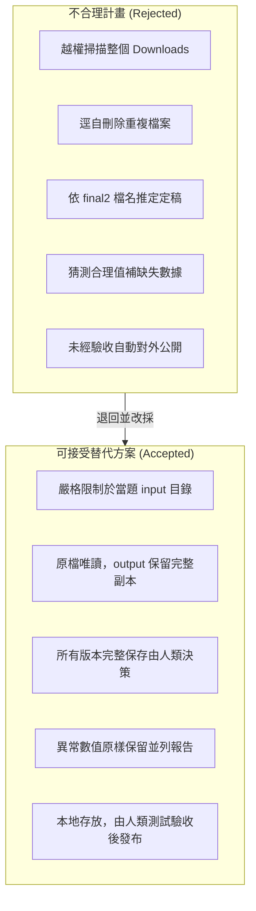

# 國立東華大學 AI Agent 實作總結簡報 (NDHU Agent Lab Summary Slides)
**Repository**: `pinan12/agent-lab-w05`  
**主題**：讓 AI 幫你完成一件校園小事 · Human-in-the-Loop 實作紀錄

---

<!-- slide -->
## Slide 1: 專案總覽與核心目標 (Overview & Objectives)

### 📌 專案定位
本專案為東華大學學生 AI Agent 一週實作練習（`agent-lab-w05`），以**「社團日常行政與課間小工具」**為情境，藉由與 AI 助理配對協作，建立**人機協同審查（Human-in-the-Loop）**的核心判斷力。

### 🎯 培養四大關鍵能力
1. **看懂計畫（Understand Plan）**：動手前檢查 AI 的工作範圍，確認是否安全、是否保留原檔。
2. **親自驗收（Inspect Results）**：透過雜湊核對、邊界條件測試，不盲信「已完成」的宣稱。
3. **辨認確認點（Recognize Checks）**：識別涉及刪檔、猜測數據、擴大範圍等高風險動作。
4. **堅決退回（Reject Bad Plans）**：發現違規或失控操作時，提供具體替代方案並退回執行。

---

<!-- slide -->
## Slide 2: 任務 A｜社團檔案整理 (`practice/01-club-files`)

### 📋 需求與挑戰
- 處理 `input/` 內 12 個模擬社團文件，分類存放至 `output/`。
- **鐵律**：原檔唯讀保留；不得因名稱有 `final` / `final2` 猜測定稿；重複檔案各留副本。

### 🛠️ 執行與成果
- **建立 5 大分類**：
  - `01-proposals/`：戶外企劃（30m）、室內企劃（20m）、雨天備案
  - `02-planning/`：會議記錄、下一步追蹤、紙張預算草案
  - `03-equipment/`：器材清單、器材備份
  - `04-publicity/`：活動公告、公告副本、海報標語
  - `05-feedback/`：問卷回饋
- **產出文件**：
  - `manifest.json`：12 筆對照清單（來源、目的地、歸類理由）
  - `report.md`：說明重複檔案雜湊分析與版本保留原因
- **驗證**：12 份副本與原檔之 **SHA-256 雜湊值 100% 吻合**。

---

<!-- slide -->
## Slide 3: 任務 B｜課間活動挑選器 (`practice/02-campus-picker`)

### 📋 需求與規格
- 讀取 `activities.json`（12 筆活動），打造單頁離線工具 `output/index.html`。
- 零依賴、無 CDN、免聯網、雙擊即開。
- 具備地點、時間、強度嚴格篩選、隨機挑選、最近 5 次歷史紀錄、重設篩選。

### 🚀 第一版 (v1) 成果
- 實現所有篩選與隨機選取演算法。
- 支援中/英單一語言切換與警語「教學模擬活動，不是校方公告」。
- 嚴格實測：室外/15m/中強度 ➜ 顯示「沒有符合條件的活動」，絕不擅自偷改條件。

### 🌟 實作修改 (Revision - v2)：中英雙語對照模式
- **原況痛點**：第一版僅能切換全中文或全英文，無法雙語比對學習。
- **修改實作**：加入 `[ 中文 | English | 中英雙語 ]` 三模式膠囊切換器。
- **雙語效果**：抽中活動並列中文主標題與英文副標題（如 `整理書包 / Organize your bag`），歷史紀錄與標籤皆雙語並列。

---

<!-- slide -->
## Slide 4: 任務 C｜社團器材記錄清理 (`practice/03-equipment`)

### 📋 需求與規範
- 清理 `equipment.json`（10 筆模擬器材記錄）。
- 文字去前後空白（數量 `qty` 不套用去空白）；狀態正規化（`available` / `borrowed` / `unknown`）。
- 嚴禁自行猜測補值、不取絕對值；相同 ID 全部保留。

### 🛠️ 清理結果統計
| 項目 | 數量 | 處置說明 |
|---|---|---|
| **原始列數** | 10 列 | 包含 1 筆全空無效列 |
| **移除列數** | 1 列 | 第 6 列為空物件 `{}`，予以剔除 |
| **有效保留** | 9 列 | 儲存至 `output/normalized.json` |

### ⚠️ 異常問題報告 (`issues.md`)
1. **缺失數量**：`EQ04` 紙張包之 `qty` 為空字串 `""`，原樣保留不補 0。
2. **負數數量**：`EQ05` 膠帶之 `qty` 為 `-1`，原樣保留不取絕對值。
3. **資料衝突**：`EQ02` 延長線有兩筆外借記錄，數量分別為 2 與 3，完整保留待人工盤點。

---

<!-- slide -->
## Slide 5: 任務 D｜安全審查與退回不合理計畫 (`practice/04-review`)

### 🚫 刻意寫錯的模擬計畫 (`bad-plan.txt`)
> 「我會把 Downloads 全部整理，刪除重複檔，把 final2 當最新版；找不到資料就補一個合理值，完成後自動把成果公開。」

### 🛡️ 審查退回與五大替代方案 (`my-rejection.md`)


---

<!-- slide -->
## Slide 6: 驗收測試矩陣 (Testing Verification Matrix)

| 測試編號 | 測試項目 | 預期結果 | 實際觀察 | 驗收狀態 |
|---|---|---|---|---|
| **Test 1** | A題 12 檔案原檔與副本比對 | 雜湊值全部相同，原檔未被修改或刪除 | 12 檔案 SHA-256 逐一比對一致 | ✅ 通過 |
| **Test 2** | B題「室外／15分鐘／中強度」 | 顯示「沒有符合條件的活動」，不偷放寬條件 | 正確顯示紅框無符合提示，歷史未增加 | ✅ 通過 |
| **Test 3** | B題「室外／30分鐘／中強度」 | 每次抽取必定為 A09（在合適位置快走） | 連續 3 次抽取皆為 A09 | ✅ 通過 |
| **Test 4** | B題連續抽取 6 次 | 歷史清單只保留最近 5 筆，最新在最上方 | 舊紀錄自動擠出，上限 5 筆 | ✅ 通過 |
| **Test 5** | B題按「重設篩選」 | 回到不限/30/不限，保留歷史紀錄 | 選項重設，歷史清單未被清空 | ✅ 通過 |
| **Test 6** | B題中英雙語對照模式 | 主副標題並列，歷史紀錄中英對照 | 完整並列雙語，無缺漏字 | ✅ 通過 |
| **Test 7** | C題器材資料正規化 | 10 列轉 9 列有效，保留異常值與重複 ID | 空列移除，負數與空值留存 | ✅ 通過 |

---

<!-- slide -->
## Slide 7: Git Commit & Push 歷程全記錄

本專案每次完成單元即進行原子化 Commit 與遠端推送，歷史軌跡清晰完整：

```text
* 6742308 (HEAD -> main, origin/main) record: learning record and screenshots
* faca33b C: clean equipment records
* 7bb7091 D: rejection
* 244f519 B v2: add bilingual display mode
* eea9193 B v1: activity picker
* 2f3e477 A: organize club files
* fa6634e Initial commit
```

| Commit ID | Message | 說明 |
|---|---|---|
| `2f3e477` | `A: organize club files` | 完成社團檔案整理、5 大分類、manifest 與報告 |
| `eea9193` | `B v1: activity picker` | 完成課間挑選器第一版（條件篩選、離線 HTML） |
| `244f519` | `B v2: add bilingual display mode` | 完成課間挑選器第二版（新增中英雙語對照切換） |
| `7bb7091` | `D: rejection` | 撰寫不合理計畫之退回分析與替代方案文件 |
| `faca33b` | `C: clean equipment records` | 完成器材文字資料清理與異常問題報告 |
| `6742308` | `record: learning record and screenshots` | 完成實作紀錄 submission-template.md 與學習總結 |

---

<!-- slide -->
## Slide 8: 實作心得與人機協同關鍵收穫 (Key Takeaways)

### 💡 核心收穫
1. **AI 擅長處理繁複事務，但邊界需由人類把關**：
   - 檔案分類、資料清理、單頁網頁生成，AI 能極速完成；但若未約束範圍，AI 容易越權或猜測數據。
2. **驗證勝於宣稱**：
   - 不要只聽信「已完成」，透過 Hash 雜湊、邊界情境（無符合項目）才能檢驗真實品質。
3. **版本控制是最好的實驗防護網**：
   - 每次階段性成果即時 Commit/Push，讓修改（v1 $\to$ v2）有跡可循，隨時可回溯與比對。

---
*簡報產出時間：2026-10-06 · 國立東華大學通識/資訊課堂 AI Agent 實作教材*
